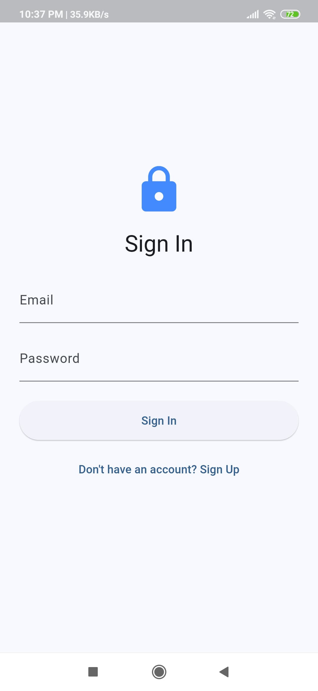
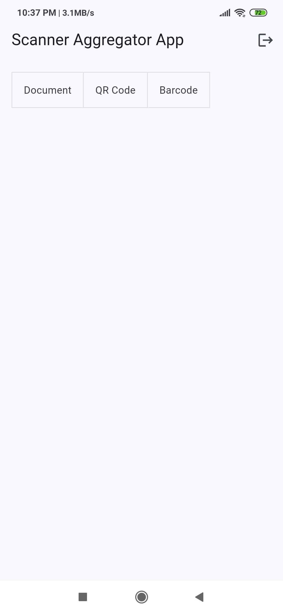
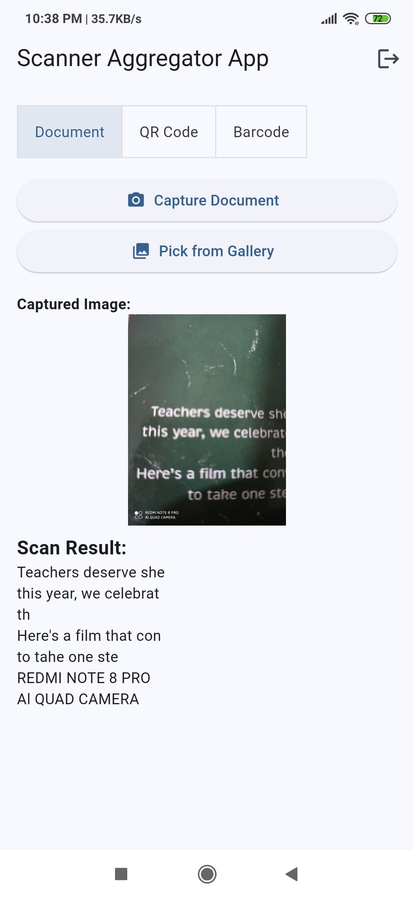
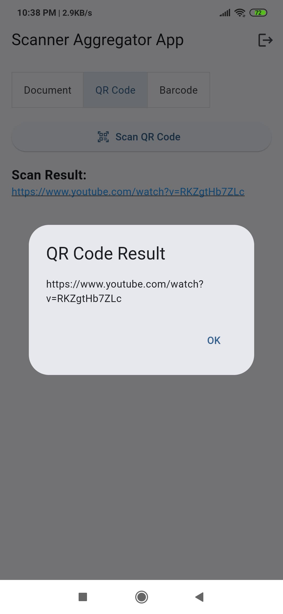
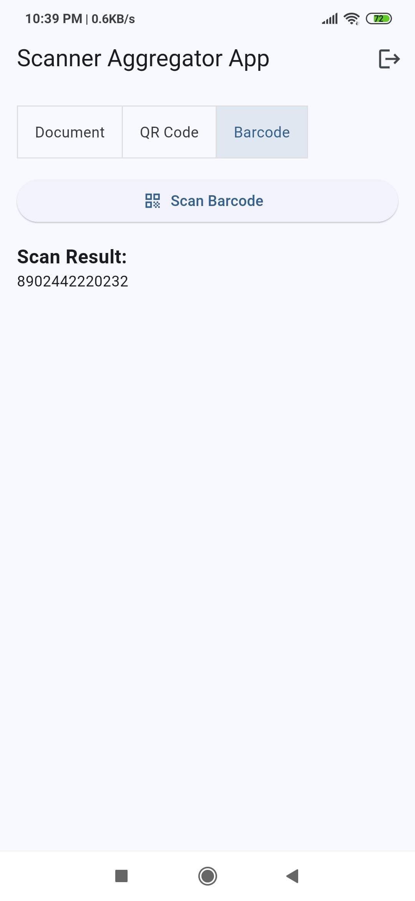

# Scanner Aggregator App

A powerful Flutter application for scanning documents, QR codes, and barcodes, with seamless Firebase authentication and gallery integration.  
This project is designed for modern Android devices and follows best practices for performance, security, and user experience.

---

## Features

- **Document Scanning with OCR**  
  Scan documents using your device camera and extract text using Google ML Kit Text Recognition.
- **QR Code & Barcode Scanning**  
  Scan and decode QR codes and barcodes with the Mobile Scanner package.
- **Firebase Authentication**  
  Secure sign-in and sign-up using Firebase Auth.
- **Save to Gallery**  
  Save scanned images and documents directly to your device gallery.
- **Modern, Responsive UI**  
  Clean Material Design with intuitive navigation and error handling.
- **Custom Plugin**  
  Includes a custom `gallery_saver` plugin for advanced gallery operations.

---

## Screenshots

<p align="center">
  
  <br/>
  <b>Sign In Screen</b>
</p>

&nbsp;

<p align="center">
  
  <br/>
  <b>Home Screen</b>
</p>

&nbsp;

<p align="center">
  
  <br/>
  <b>Document Scanner</b>
</p>

&nbsp;

<p align="center">
  
  <br/>
  <b>QR Code Scanner</b>
</p>

&nbsp;

<p align="center">
  
  <br/>
  <b>Barcode Scanner</b>
</p>

---

## Getting Started

### Prerequisites
- Flutter 3.x (Dart 3.x)
- Android Studio or VS Code
- Firebase Project (for authentication)

### Setup Instructions

1. **Clone the repository**
   ```sh
   git clone https://github.com/your-username/scanner_aggregator_app.git
   cd scanner_aggregator_app
   ```

2. **Install dependencies**
   ```sh
   flutter pub get
   ```

3. **Firebase Setup**
   - Create a Firebase project at [Firebase Console](https://console.firebase.google.com/).
   - Download your `google-services.json` and place it in `android/app/`.

4. **Run the app**
   ```sh
   flutter run
   ```

---

## Project Structure

```
flutter_demo_app/
├── android/              # Android platform code
├── gallery_saver/        # Custom plugin for saving images/videos to gallery
├── lib/                  # Main Flutter/Dart code
│   ├── main.dart         # App entry point
│   └── firebase_options.dart
├── screenshots/          # Project screenshots
├── pubspec.yaml          # Project dependencies
├── README.md
└── .gitignore
```

---

## Contributing

Contributions, issues, and feature requests are welcome!  
Feel free to fork the repo and submit a pull request.

---

## License

This project is licensed under the [Apache License 2.0](LICENSE).

---

## Acknowledgements

- [Flutter](https://flutter.dev/)
- [Firebase](https://firebase.google.com/)
- [Google ML Kit](https://developers.google.com/ml-kit)
- [Mobile Scanner](https://pub.dev/packages/mobile_scanner)
- [Image Picker](https://pub.dev/packages/image_picker)

---
